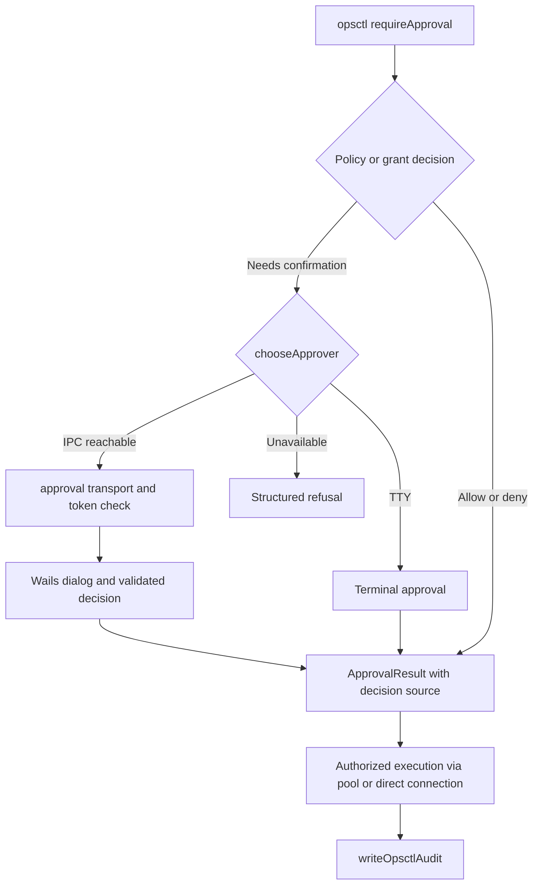

# Windows local IPC diagnosis and verification

This reference accompanies the Windows named-pipe change. It separates the
reported machine-specific failure from portable regression tests. For the
current process topology and approval/audit flow, see [Architecture §8](../ARCHITECTURE.md#8-opsctl--the-multi-process-flow).

## Evidence and scope

Investigation base: upstream `1c78542c33857dd3493b015ec6e1b3da4393de53`.
`v1.13.3` is `5dd1b09`; `v1.13.4` is `835ac68`. Both tags and that base use
`net.Listen("unix", ...)` / `net.Dial("unix", ...)` for both desktop endpoints.
The intervening shutdown fixes interrupt active IPC connections, but do not
replace the Windows AF_UNIX transport.

The reporter observed **connect** failing with Winsock **10022 / InvalidArgument**
for both endpoints in the original AppData directory, in a normal user context.
An independent .NET AF_UNIX listener reproduced connect failure there. Direct
access on D:, access through an AppData Junction to D:, and bind/connect through
that Junction succeeded. Copying the application/data without upgrading or
changing approval rules restored both endpoints and a user-approved command
(exit 0, audit `success=1`, `decision_source=user_allow`). These are **reporter
observations**, not measurements made by the CI runner.

This establishes a directory-dependent AF_UNIX failure and an affected
application dependency. It does **not** identify path length, ACLs, antivirus,
filesystem corruption or a Windows kernel defect as the underlying cause.
Zero-byte socket files and reparse attributes alone do not prove corruption.
Sandbox-only credential failures or socket 10013 are distinct observations.

The original AppData path is now a Junction. Success through it measures the
replacement target, not the original directory. Do not undo that migration to
reproduce the fault. An isolated new AppData directory is another useful sample,
not an exact reconstruction of the original filesystem state.

## Implementation findings

| Boundary | Files and functions | Finding |
| --- | --- | --- |
| Data directory | `internal/bootstrap/bootstrap.go`: `AppDataDir`, `Init`, `ResolvedDataDir`; `main.go`: `resolveBootstrap` | Desktop and CLI share the resolved data directory; Windows defaults to LOCALAPPDATA/opskat, with portable and explicit overrides. |
| Logical endpoints | `internal/approval/approval.go`: `SocketPath`; `internal/sshpool/server.go`: `SocketPath` | Separate `approval.sock` and `sshpool.sock` identities under that directory. |
| Original transport | Both `Server.Start` methods; approval `RequestApproval`; pool `Client.IsAvailable`, `Client.handshake` | Duplicated Unix listener/dialer/cleanup code; no shared platform implementation. Both services have the same dependency. |
| Early routing | `cmd/opsctl/command/interactive.go`: `dialApprovalSocket`, `chooseApprover` | An additional direct Unix dial selected desktop approval vs refusal before the request was sent. Single and batch approvals share this probe. |
| Authentication | `internal/bootstrap/auth_token.go`; both server `handleConn` methods | Startup generates `auth.token`; CLI supplies it, servers reject mismatches before invoking the approval handler or pool operation. |
| Desktop lifecycle | `internal/app/opsctl/opsctl.go`: `Startup`, `Cleanup`; `approval.go`: `startApprovalServer`, `startSSHPoolServer` | Startup failures are logged; the GUI can remain running with IPC unavailable. No automatic listener restart. Cleanup closes listeners and accepted connections. |
| Approval and audit | `cmd/opsctl/command/approval.go`: `requireApproval`, `ToCheckResult`; `internal/app/opsctl/approval.go`: `requestSingleApproval`, `RespondOpsctlApproval`; `cmd/opsctl/command/exec.go`: `execSSHStreaming` | Policy/grant check precedes interactive/desktop selection. Wails dialog returns a validated user decision; CLI carries that decision source into `writeOpsctlAudit`. No approval is inferred from transport success. |
| Pool lifecycle | `internal/sshpool/pool.go`: `Get`, `Release`, `Remove`, `cleanupLoop`, `Close` | Reference-counted SSH connections are reused, checked for liveness, removed on failure and reaped after idle timeout. CLI IPC connections themselves are opened per operation. |



## Transport choice and boundaries

`internal/localipc` owns `Listen`, `Dial`, and `DialContext`. All five client
connection sites and both listeners use it. Existing `SocketPath` APIs remain
logical identifiers; on Windows they are not filesystem socket addresses.

Windows uses `github.com/Microsoft/go-winio` byte-stream named pipes. Pipe names
hash the current process user's SID, the absolute symlink-resolved directory path,
and the endpoint basename. Go normalizes drive/component case and short names
during Windows `EvalSymlinks`; the legacy `.sock` entry is never resolved. Thus directory aliases (including Junctions) share an
endpoint, separate directories and services do not, and long/non-ASCII paths
are not passed to AF_UNIX. Directory resolution errors are returned; there
is no common-name or TCP fallback.

The pipe has a protected DACL allowing only the current user's SID. go-winio
rejects remote pipe clients, reserves the first instance exclusively and uses
anonymous security quality of service on client opens. Existing application
tokens and authorization decisions remain unchanged. This does not attempt to
isolate mutually untrusted processes running as the same Windows user.

Moving data or changing socket directories would keep the unreliable AF_UNIX
dependency and add migration/discovery concerns. Loopback TCP would require
port discovery and additional network-facing security handling. Native named
pipes remove that dependency while fitting the existing `net.Conn` protocols.

On macOS/Linux the original Unix addresses, stream protocols and 0600
permissions remain. Stale socket recovery is shared: only socket nodes whose
probe reports refusal/not-found may be removed. Permission errors, regular files
and symlinks are not treated as stale sockets. Failure to set owner-only
permissions closes the listener and returns an error.

Connection establishment has a two-second bound; human approval waiting and
stream execution have no new deadline. Failure is returned/logged with its
wrapped cause. Requests are never automatically replayed after a broken
connection. Existing policy/grant/TTY/refusal behavior and the SSH client's
existing direct-connection fallback are preserved.

**Upgrade the Windows desktop and opsctl together, then restart the desktop.**
Old Windows binaries speak AF_UNIX and cannot reach the new pipe. No dual
listener or silent downgrade is introduced. Existing `.sock` entries are left
untouched on Windows. Closing or killing the process releases its pipe handles;
a new process creates a fresh listener. Databases, master keys and tokens stay
in the selected data directory; this change needs no data migration.

## Independent AF_UNIX probe

[`scripts/Test-WindowsUnixSocket.ps1`](../../scripts/Test-WindowsUnixSocket.ps1)
runs on Windows with PowerShell 7. It uses .NET sockets only, with no OpsKat,
server assets, credentials or database initialization. It emits JSON Lines for
socket creation, bind, listen, connect, accept, payload transfer and cleanup,
including underlying SocketException native codes and the failure stage. Stages
after a failure are not attempted. A pending accept canceled during cleanup is
not reported as the primary failure.

Run in the **same ordinary user context** as the application. Keep the identity,
elevation, ASCII basename and full pathname length constant across cases. The
following creates only new disposable directories; choose an existing local
drive if D: is unavailable:

```powershell
$id = [guid]::NewGuid().ToString('N').Substring(0,8)
$plain = Join-Path $env:LOCALAPPDATA "ipc-a-$id"
$junction = Join-Path $env:LOCALAPPDATA "ipc-j-$id"
$target = "D:\ipc-d-$id"
$target += 'x' * ($plain.Length - $target.Length)
New-Item -ItemType Directory $plain,$target | Out-Null
New-Item -ItemType Junction -Path $junction -Target $target | Out-Null

./scripts/Test-WindowsUnixSocket.ps1 `
  -BindDirectory $plain,$target,$junction,$junction,$target `
  -ConnectDirectory $plain,$target,$junction,$target,$junction |
  Set-Content ./ipc-probe.jsonl
```

This compares ordinary AppData, another drive, Junction bind/connect, and both
alias/target directions at equal textual lengths. The script records actual
UTF-8 byte lengths, OS/.NET versions, user SID/elevation, directory attributes
and link targets. For length and Unicode experiments, create separate disposable
directories and change **one variable per run**; label long-path bind failures
separately from the reported connect-stage 10022. Ancestor Junctions may not be
visible in the final directory's attributes; retain the directory setup with
the results. The probe does not interpret those attributes as a diagnosis.

After collecting results, remove only the newly created Junction and disposable
directories. The script itself removes only the unique endpoint it successfully
bound, never an existing application endpoint or data directory.

## Regression verification

The `Local IPC` workflow runs real OS transports on Windows, macOS and Linux:

- Approval request/response with valid, missing and invalid tokens; user allow
  and deny; refusal after shutdown; exclusive startup and fresh-server restart.
- Pool authentication before operation dispatch; real client JSON handshake and
  binary stdout/stderr/exit frames against an isolated protocol peer.
- Bidirectional large byte streams, connection cancellation and blocked-accept
  shutdown; both servers actively disconnect accepted clients.
- Windows Junction/case aliases, service/directory isolation, actual pipe DACL,
  long Unicode directory with untouched legacy endpoint, busy-pipe deadline,
  and abrupt child-process death followed by rebinding.
- Unix stale socket recovery, 0600 permissions, cleanup, and preservation of
  regular files/symlinks.
- Actual CLI approval probe chooses the desktop with a running listener and
  structured refusal after it stops; existing policy/approval tests remain.

CI's AF_UNIX probe uses new runner directories and its own recorded identity.
Passing there does not reproduce or disprove the reporter's original AppData
failure. Transport/handler tests do not assert that a native Wails dialog was
clicked or that a production audit row was written. Verify that final user flow
on the affected Windows machine after upgrading both binaries, without undoing
the working directory migration.
